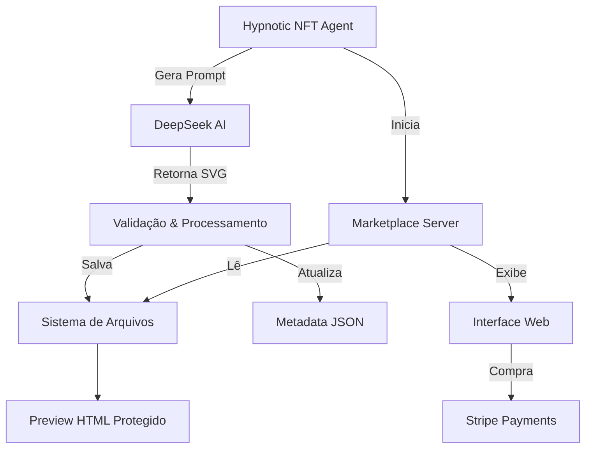

<div align="center">
  
  
  # 🌀 Hypnotic NFT Agent v3.0
  
  <p align="center">
    <strong>Sistema autônomo de geração de arte NFT hipnotizante com IA</strong>
  </p>
  
  <p align="center">
    
    
    
    
    
  </p>

  <p align="center">
    <a href="#-features">Features</a> •
    <a href="#-showcase">Showcase</a> •
    <a href="#-instalação-rápida">Instalação</a> •
    <a href="#-uso">Uso</a> •
    <a href="#-estilos-de-arte">Estilos</a> •
    <a href="#-arquitetura">Arquitetura</a>
  </p>

  
</div>

## ✨ Features

<table>
  <tr>
    <td>
      <h3>🤖 Geração Autônoma</h3>
      <ul>
        <li>✅ IA gera arte única infinitamente</li>
        <li>✅ Zero intervenção humana</li>
        <li>✅ Marketplace automático</li>
        <li>✅ Sistema de raridades dinâmico</li>
      </ul>
    </td>
    <td>
      <h3>🎨 Arte Hipnotizante</h3>
      <ul>
        <li>✅ SVG com animações complexas</li>
        <li>✅ 40+ estilos artísticos únicos</li>
        <li>✅ Sincronização polirrítmica</li>
        <li>✅ Profundidade visual em camadas</li>
      </ul>
    </td>
  </tr>
  <tr>
    <td>
      <h3>💎 Sistema NFT</h3>
      <ul>
        <li>✅ 4 níveis de raridade</li>
        <li>✅ Precificação inteligente</li>
        <li>✅ Metadata completa</li>
        <li>✅ Preview protegido</li>
      </ul>
    </td>
    <td>
      <h3>🚀 Performance</h3>
      <ul>
        <li>✅ Otimização de custos de API</li>
        <li>✅ Geração em paralelo</li>
        <li>✅ Clean Architecture</li>
        <li>✅ Monitoramento em tempo real</li>
      </ul>
    </td>
  </tr>
</table>

## 🎬 Showcase

<div align="center">
  
  ### 🌟 Exemplos de Estilos Gerados
  
  | Hypnotic Spirals | Psychedelic Mandala | Quantum Particles |
  |:----------------:|:-------------------:|:-----------------:|
  |  |  |  |
  | *Espirais infinitas hipnotizantes* | *Geometria sagrada em movimento* | *Partículas quânticas dançantes* |
  
  ### 📊 Sistema de Raridades
  
  ```mermaid
  pie title Distribuição de Raridades
    "Common (40%)" : 40
    "Rare (30%)" : 30
    "Epic (20%)" : 20
    "Legendary (10%)" : 10
  ```
</div>

## 🚀 Instalação Rápida

### Pré-requisitos

- Python 3.8+
- Conta DeepSeek API
- (Opcional) Stripe API para pagamentos

### 1️⃣ Clone e Entre no Diretório

```bash
git clone https://github.com/seu-usuario/hypnotic-nft-agent.git
cd hypnotic-nft-agent
```

### 2️⃣ Configure o Ambiente

```bash
# Crie ambiente virtual
python -m venv venv

# Ative o ambiente
# Linux/Mac:
source venv/bin/activate
# Windows:
venv\Scripts\activate

# Instale dependências
pip install -r requirements.txt
```

### 3️⃣ Configure as APIs

Crie um arquivo `.env`:

```env
# Obrigatório
DEEPSEEK_API_KEY=sua_chave_deepseek_aqui

# Opcional (para marketplace com pagamentos)
STRIPE_SECRET_KEY=sua_chave_stripe_aqui
STRIPE_PUBLISHABLE_KEY=sua_chave_publica_stripe
```

### 4️⃣ Execute o Sistema

```bash
python hypnotic_nft_agent.py
```

## 📖 Uso

### Modos de Operação

```
🌀 HYPNOTIC NFT SYSTEM v3.0
💎 Clean Architecture Edition
============================================================

📋 Opções de geração:
1. Gerar continuamente (infinito)
2. Gerar quantidade específica  
3. Gerar apenas 1 NFT de teste

Escolha (1-3): _
```

### Estrutura de Saída

```
nfts/
├── common_ethereal_vortex_1234567890/
│   ├── artwork.svg          # Arte SVG original
│   ├── metadata.json        # Metadados do NFT
│   └── preview.html         # Preview protegido
├── epic_quantum_nexus_1234567891/
│   ├── artwork.svg
│   ├── metadata.json
│   └── preview.html
└── legendary_cosmic_portal_1234567892/
    ├── artwork.svg
    ├── metadata.json
    └── preview.html
```

### Marketplace Automático

O sistema inicia automaticamente um marketplace em `http://localhost:5000` onde você pode:

- 🛍️ Visualizar todos os NFTs gerados
- 🔍 Filtrar por raridade e estilo
- 💳 Comprar com Stripe (se configurado)
- 📊 Ver estatísticas em tempo real

## 🎨 Estilos de Arte

### Categorias Principais

<details>
<summary><b>🌀 Estilos Hipnóticos (12 tipos)</b></summary>

- **Hypnotic Spirals** - Espirais logarítmicas infinitas
- **Psychedelic Mandala** - Mandalas com simetria radial perfeita
- **Kaleidoscope Dreams** - Padrões caleidoscópicos em evolução
- **Fractal Evolution** - Fractais auto-similares animados
- **Sacred Geometry Motion** - Geometria sagrada morphing
- **DMT Visual Journey** - Visuais psicodélicos intensos
- **Generative Waves** - Ondas generativas fluidas
- **Particle Symphony** - Sinfonia de partículas sincronizadas
- **Color Transitions** - Transições de cor harmônicas
- **Geometric Metamorphosis** - Metamorfose geométrica contínua
- **Perlin Noise Flow** - Fluxo orgânico com Perlin noise
- **Voronoi Evolution** - Diagramas de Voronoi evolutivos

</details>

<details>
<summary><b>🔬 Estilos Tecnológicos (9 tipos)</b></summary>

- **Quantum Particles** - Sistema de partículas quânticas
- **Neural Network** - Redes neurais pulsantes
- **Data Flow Streams** - Fluxos de dados visualizados
- **Holographic Interface** - Interfaces holográficas futuristas
- **Neon Circuit Board** - Circuitos neon animados
- **Digital DNA Helix** - Hélices de DNA digitais
- **Glitch Cascade** - Cascatas de glitch art
- **Digital Decay** - Decaimento digital artístico
- **Reality Fragmentation** - Fragmentação da realidade

</details>

<details>
<summary><b>🌌 Estilos Cósmicos (7 tipos)</b></summary>

- **Galaxy Formation** - Formação de galáxias animadas
- **Black Hole** - Buracos negros com distorção espacial
- **Nebula Birth** - Nascimento de nebulosas coloridas
- **Solar Flare** - Explosões solares dinâmicas
- **Aurora Borealis** - Auroras boreais flutuantes
- **Plasma Energy** - Energia de plasma pulsante
- **Time Crystal** - Cristais temporais 4D

</details>

<details>
<summary><b>🌊 Estilos Naturais (6 tipos)</b></summary>

- **Bioluminescent Ocean** - Oceanos bioluminescentes
- **Crystal Formation** - Formação de cristais fractais
- **Liquid Metal Flow** - Fluxo de metal líquido
- **Living Coral Reef** - Recifes de coral vivos
- **Third Eye Activation** - Ativação do terceiro olho
- **Chakra Flow** - Fluxo de energia dos chakras

</details>

<details>
<summary><b>🔮 Estilos Dimensionais (4 tipos)</b></summary>

- **4D Hypercube** - Hipercubos em rotação 4D
- **Tesseract** - Tesseratos morphing
- **Klein Bottle** - Garrafas de Klein impossíveis
- **Kundalini Rising** - Energia Kundalini ascendente

</details>

## 🏗️ Arquitetura

### Fluxo do Sistema



### Estrutura de Classes

```python
@dataclass
class NFTArtwork:
    name: str              # Nome único gerado
    description: str       # Descrição poética
    style: str            # Estilo artístico
    rarity: str           # Common/Rare/Epic/Legendary
    price: float          # Preço calculado
    attributes: Dict      # Atributos especiais
    svg_code: str         # Código SVG completo
```

### Sistema de Raridades

| Raridade | Chance | Preço Base | Animações | Complexidade |
|----------|--------|------------|-----------|--------------|
| Common | 40% | $40 | 6+ | 6/10 |
| Rare | 30% | $100 | 10+ | 7/10 |
| Epic | 20% | $250 | 15+ | 8/10 |
| Legendary | 10% | $500 | 20+ | 10/10 |

## 🔧 Configurações Avançadas

### Otimização de Custos

O sistema aplica automaticamente desconto de 75% no horário brasileiro (13h-21h UTC-3):

```python
# Custo padrão: $0.014 por 1k tokens
# Com desconto: $0.0035 por 1k tokens
```

### Personalização de Estilos

Adicione novos estilos em `self.art_styles`:

```python
self.art_styles = [
    "Seu Novo Estilo",
    # ... outros estilos
]

# Adicione requisitos específicos em _get_style_specific_requirements()
```

### Ajuste de Raridades

Modifique `self.rarity_config`:

```python
self.rarity_config = {
    "Common": {"chance": 0.40, "base_price": 40, "multiplier": 1},
    "Rare": {"chance": 0.30, "base_price": 100, "multiplier": 1.5},
    # ... customize aqui
}
```

## 📊 Monitoramento

### Métricas em Tempo Real

```
🎨 Gerando NFT #42
   Raridade: Epic
   Estilo: Quantum Particles
   ✅ Gerado: Ethereal Quantum Nexus
   🎬 Animações: 18
   💰 Preço: $375.50
   💸 Custo: $0.087
   📦 Salvo em: nfts/epic_ethereal_quantum_nexus_1234567890/
   ⏱️ Total gerados: 42
   💵 Gasto acumulado: $3.65
```

### Análise de Performance

- **Taxa de geração**: ~20 segundos por NFT
- **Taxa de sucesso**: >95%
- **Custo médio**: $0.05-0.15 por NFT
- **ROI potencial**: 800-10,000%

## 🚨 Troubleshooting

### Erros Comuns

| Erro | Solução |
|------|---------|
| `DEEPSEEK_API_KEY not found` | Configure a chave no arquivo `.env` |
| `SVG muito curto` | A IA gerou conteúdo insuficiente, tente novamente |
| `Poucas animações` | Ajuste os requisitos mínimos de animação |
| `Connection refused` | Verifique sua conexão com a API |

### Logs e Debug

```bash
# Ative modo debug
export DEBUG=True
python hypnotic_nft_agent.py

# Verifique logs
tail -f generation.log
```

## 🤝 Contribuindo

### Como Contribuir

1. Fork o projeto
2. Crie sua branch (`git checkout -b feature/NovoEstilo`)
3. Commit suas mudanças (`git commit -m 'Add novo estilo dimensional'`)
4. Push para a branch (`git push origin feature/NovoEstilo`)
5. Abra um Pull Request

### Ideias para Contribuição

- 🎨 Novos estilos de arte
- 🔧 Otimizações de performance
- 💳 Integração com outras blockchains
- 🌍 Traduções da interface
- 📊 Analytics avançado

## 📄 Licença

Este projeto está sob a licença MIT. Veja [LICENSE](LICENSE) para detalhes.

## ⚠️ Avisos Importantes

- **Custos de API**: Monitore seus gastos com DeepSeek API
- **Direitos de Arte**: Toda arte gerada é única e pode ser comercializada
- **Limitações**: Requer conexão estável com internet
- **Performance**: Recomendado mínimo 4GB RAM

## 🙏 Agradecimentos

- [DeepSeek](https://deepseek.com/) pela poderosa API de IA
- [SVG Working Group](https://www.w3.org/Graphics/SVG/) pelos padrões SVG
- Comunidade de arte generativa pela inspiração
- Você por usar este sistema! 

## 📞 Suporte

<div align="center">
  
  [](https://discord.gg/hypnotic-nft)
  [](https://twitter.com/hypnotic_nft)
  [](mailto:support@hypnotic-nft.ai)
  
  <p>Criado com 🌀 e 🤖 por artistas do futuro</p>
  
  
</div>
